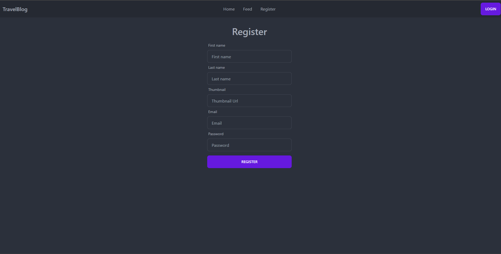
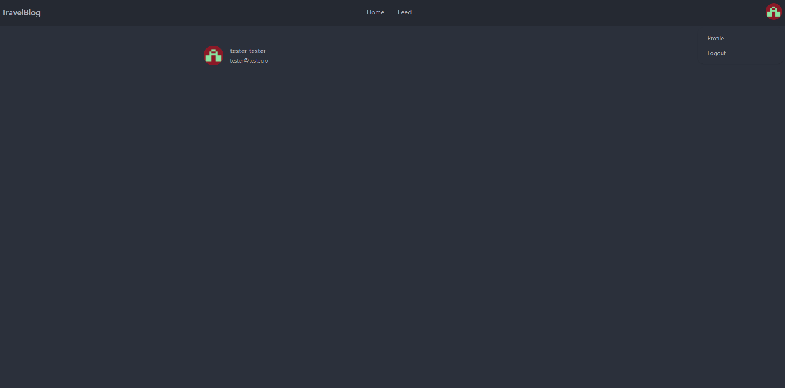
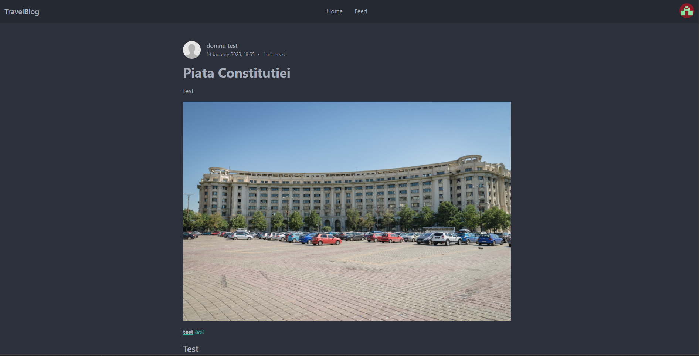
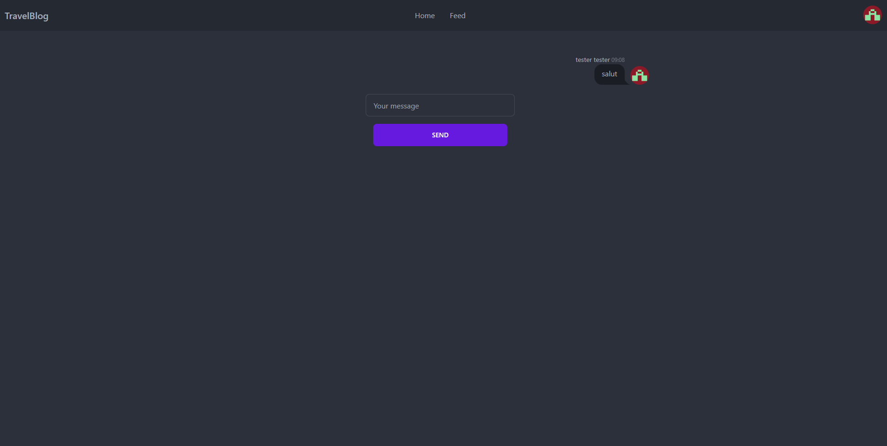
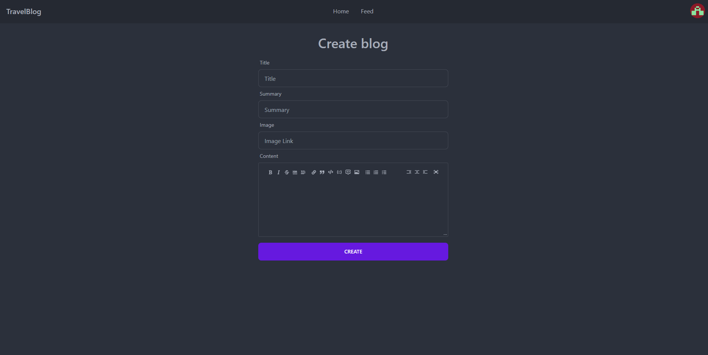

# Travel_Blog

Welcome to the travel blog app, where you can share with your friends your blogs and message them 

# Frontend

### Register

### Login

### Main Page

### Profile

### Feed

### Blog

### Other user profile

### Chat

### Create blog

# Backend

## Blog Manager

## Identity service

## Direct Messaging

# Infrastructure

- Azure cosmos db
- Azure database for MySQL
- Azure Kubrenetes cluster
- Azure Container Registry
- Key vault for nst environment

